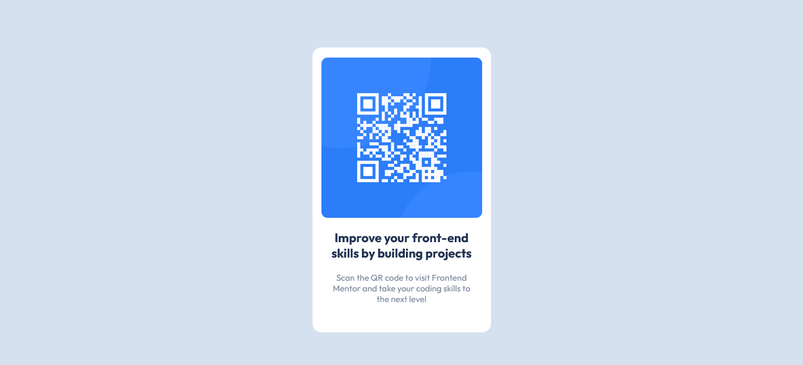

# Frontend Mentor - QR code component solution

This is a solution to the [QR code component challenge on Frontend Mentor](https://www.frontendmentor.io/challenges/qr-code-component-iux_sIO_H). Frontend Mentor challenges help you improve your coding skills by building realistic projects.

## Table of contents

- [Overview](#overview)
  - [Screenshot](#screenshot)
  - [Links](#links)
- [My process](#my-process)
  - [Built with](#built-with)
  - [Continued development](#continued-development)
- [Author](#author)

## Overview

### Screenshot

### Links

- Solution URL: (https://github.com/DantDev/Qr-Component)
- Live Site URL: (https://chic-frangipane-b2bf37.netlify.app/)

## My process

### Built with

- Semantic HTML5 markup
- CSS
- [React](https://reactjs.org/) - JS library
- [Next.js](https://nextjs.org/) - React framework

### Continued development

This project was a good way to practice my CSS skills , I intent to keep developing the skills , and improving on my curriculum.

## Author

- Portfolio - [Pedro Calixto](https://wondrous-chaja-b0f2e7.netlify.app/)
- Frontend Mentor - [@DantDev](https://www.frontendmentor.io/profile/DantDev)
- Instagram - [@p3drr0](https://www.twitter.com/p3drr0)
